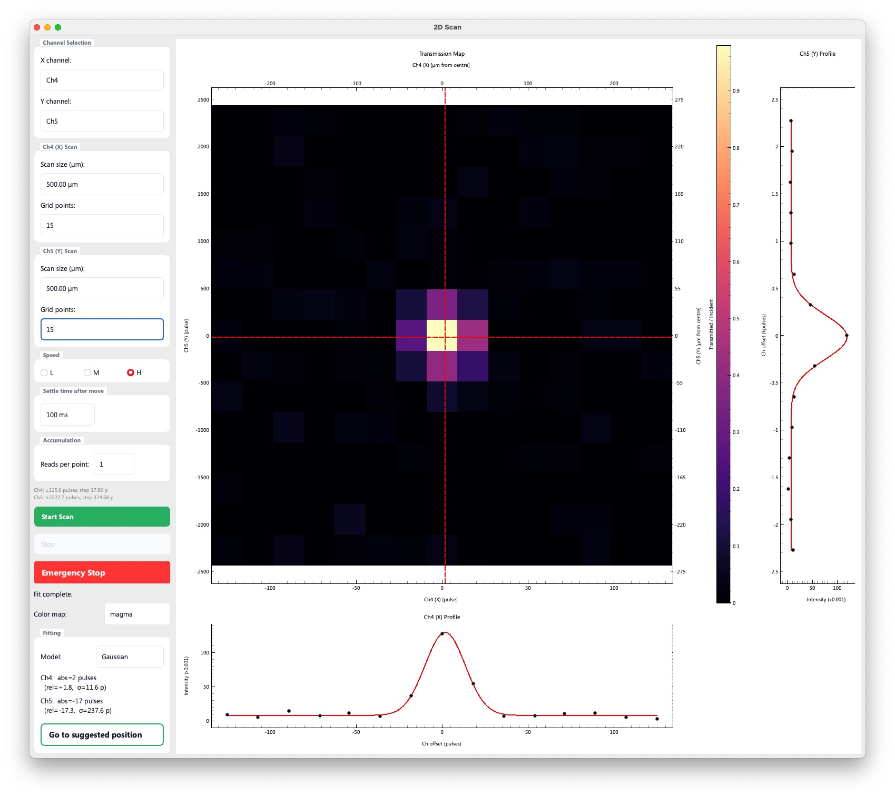
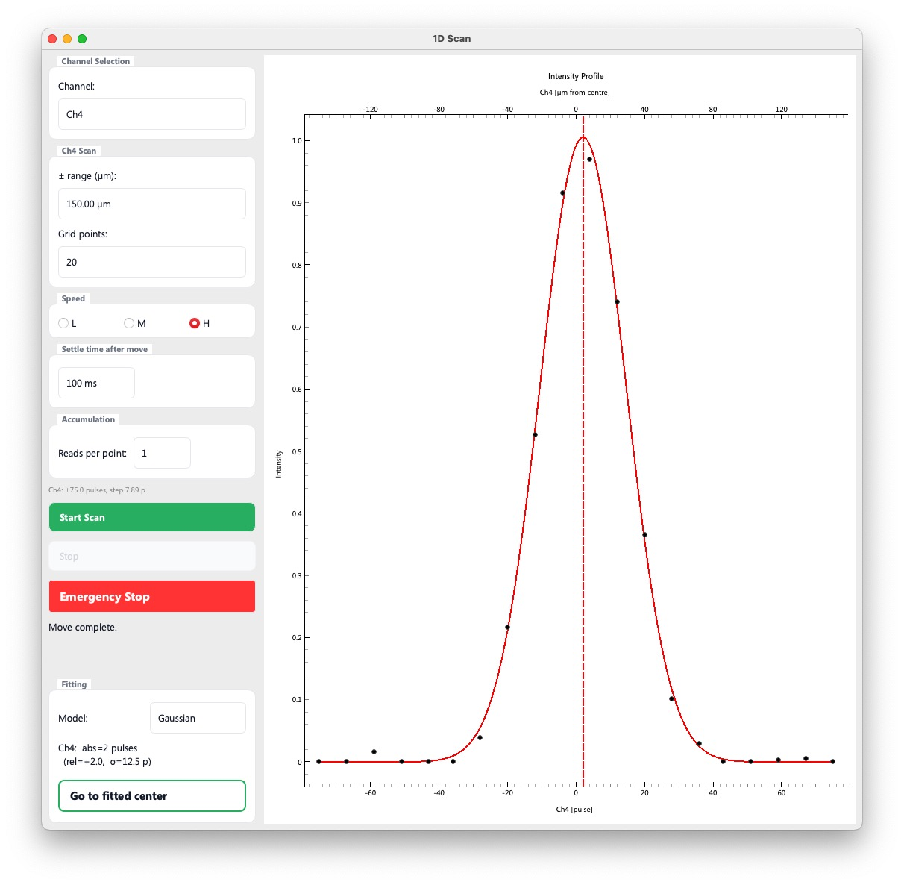

# Scans > Collimator scan, DAC scan (normal), General 2D scan, General 1D scan

## 2Dスキャンアプリ群

Collimator scan, DAC scan (normal), General 2D scan は、スキャンする軸が異なる以外は同一のアプリケーションであり、General 2D scanには、スキャンに用いる軸を自由に選ぶ機能が追加されている以外は、３つのアプリケーションの機能は共通です。内部的にも、Collimator scanおよびDAC scanは、General 2D scanの特殊例として、General 2D scan用に定義された函数を用いて実装されています。

以下、General 2D scanアプリのスクリーンショットを示します。

- （General 2D scanのみ）ユーザーは、スキャンに使用するステージを二つ選びます。
- それぞれの軸について、スキャン範囲（全幅で指定）と、グリッド数を指定します。
- Speedで、スキャン中のステージの移動速度を指定します。
- Settle time after move は、移動完了後、X線強度を読み取るまでの待ち時間です。デフォルトは100 msです。DACを用いた試験測定では、0 msでも結果は変わりませんでしたが、ステージの振動などが気になる場合にはこちらを設定してください。
- Reads per point は、各スキャン点においてX線強度の読み取りを何回行うかを設定する項目です。X線強度の読み取りは非常に速いため、10程度の値にしても、スキャンにかかる時間はほぼ変わりません。
- 設定が完了したら、Start scanを押すと、自動的にスキャンが開始されます。いつでも緊急停止可能です。
- Fitting では、Gaussian または Aperture (erf)を選択できます。 Apertureは、両端がerfで定義された台形形の函数です。

> スキャンを途中で停止（Stop）しても、それまでのデータを用いてフィッティングが行われます。

## 1D scan

スキャンする軸が一つになったスキャンアプリであり、ある特定の並進ステージを移動させながら、透過X線強度を読み取り、フィットして最適位置を推定します。

