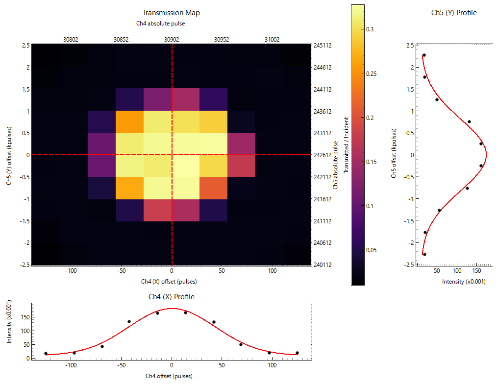
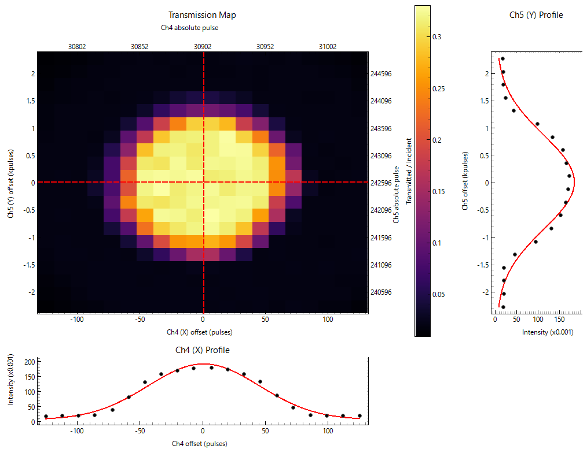

# Scans > Collimator scan, DAC scan (normal), General 2D scan, General 1D scan

## 2Dスキャンアプリ群

Collimator scan, DAC scan (normal), General 2D scan は、スキャンする軸が異なる以外は同一のアプリケーションであり、General 2D scanには、スキャンに用いる軸を自由に選ぶ機能が追加されている以外は、３つのアプリケーションの機能は共通です。内部的にも、Collimator scanおよびDAC scanは、General 2D scanの特殊例として、General 2D scan用に定義された函数を用いて実装されています。

以下、General 2D scanアプリのスクリーンショットを示します。


- （General 2D scanのみ）ユーザーは、スキャンに使用するステージを二つ選びます。
- それぞれの軸について、スキャン範囲（全幅で指定）と、グリッド数を指定します。
- Speedで、スキャン中のステージの移動速度を指定します。
- Settle time after move は、移動完了後、X線強度を読み取るまでの待ち時間です。デフォルトは100 msです。DACを用いた試験測定では、0 msでも結果は変わりませんでしたが、ステージの振動などが気になる場合にはこちらを設定してください。
- Reads per point は、各スキャン点においてX線強度の読み取りを何回行うかを設定する項目です。X線強度の読み取りは非常に速いため、10程度の値にしても、スキャンにかかる時間はほぼ変わりません。
- 設定が完了したら、Start scanを押すと、自動的にスキャンが開始されます。いつでも緊急停止可能です。
- Fitting では、Gaussian または Aperture (erf)を選択できます。 Apertureは、両端がerfで定義された台形形の函数です。

> スキャンを途中で停止（Stop）しても、それまでのデータを用いてフィッティングが行われます。

### テスト：フィッティングを行うことによる時間短縮の効果

- 目的：フィッティングを行えば、ある程度粗いスキャンデータからでも、正確な試料位置を見積もれる可能性がある。スキャンの粗さが最終的な試料位置に与える影響を調べるため、BL-18Cでの実機を用いたDACスキャンにおいて、試料を動かさず、スキャンの粗さを変化させて繰り返しスキャンを行った。
- 条件：BAデザイン（キュレット径 600 µm）のダイヤモンドアンビルを装着したDACと、ステンレスガスケット（初期厚み 200 µm、初期穴径 300 µm）を用い、試料として水を封入した。これをX線軸上に置き、フォトダイオードを用いて透過X線強度を測定しながら、Ch4およびCh5を動かしてDACスキャンを行った。スキャン範囲は各軸 500 µm とした。

#### 10 x 10 スキャンの結果



```json
  "gaussian_fit": {
    "ch4": {
      "fit_ok": true,
      "center_abs_pulse": 30902,
      "center_rel_pulse": 0.469,
      "sigma_pulse": 43.137
    },
    "ch5": {
      "fit_ok": true,
      "center_abs_pulse": 242596,
      "center_rel_pulse": -0.348,
      "sigma_pulse": 819.306
    }
  },
```

#### 20 x 20 スキャンの結果



```json
  "gaussian_fit": {
    "ch4": {
      "fit_ok": true,
      "center_abs_pulse": 30903,
      "center_rel_pulse": 0.851,
      "sigma_pulse": 44.424
    },
    "ch5": {
      "fit_ok": true,
      "center_abs_pulse": 242606,
      "center_rel_pulse": 9.812,
      "sigma_pulse": 862.962
    }
  },
```

ここから、スキャンを細かくしても、Ch4 は 1パルス（2 µm）、Ch 5 は 10 パルス（1.1 µm）しか違いを生じなかったことがわかる。すなわち、適切にフィッティングを行えば、粗いスキャンであっても、細かいスキャンから得られるのと同程度に確からしい試料位置が推定できる可能性が高いことがわかった。これにより実験時間の短縮につながると考えられる。


## 1D scan

スキャンする軸が一つになったスキャンアプリであり、ある特定の並進ステージを移動させながら、透過X線強度を読み取り、フィットして最適位置を推定します。

