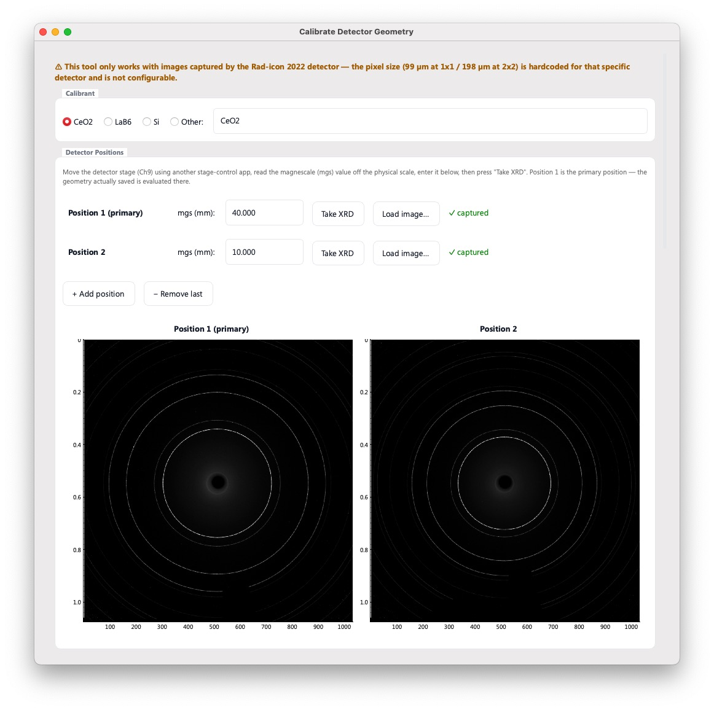
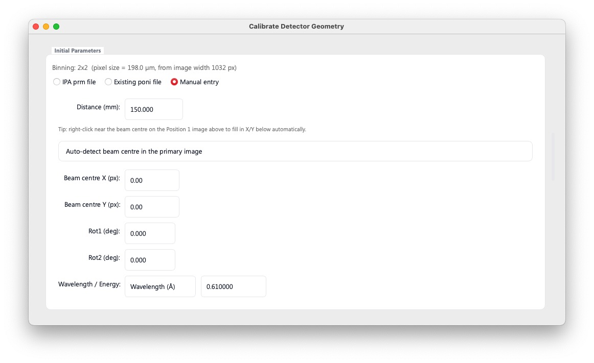
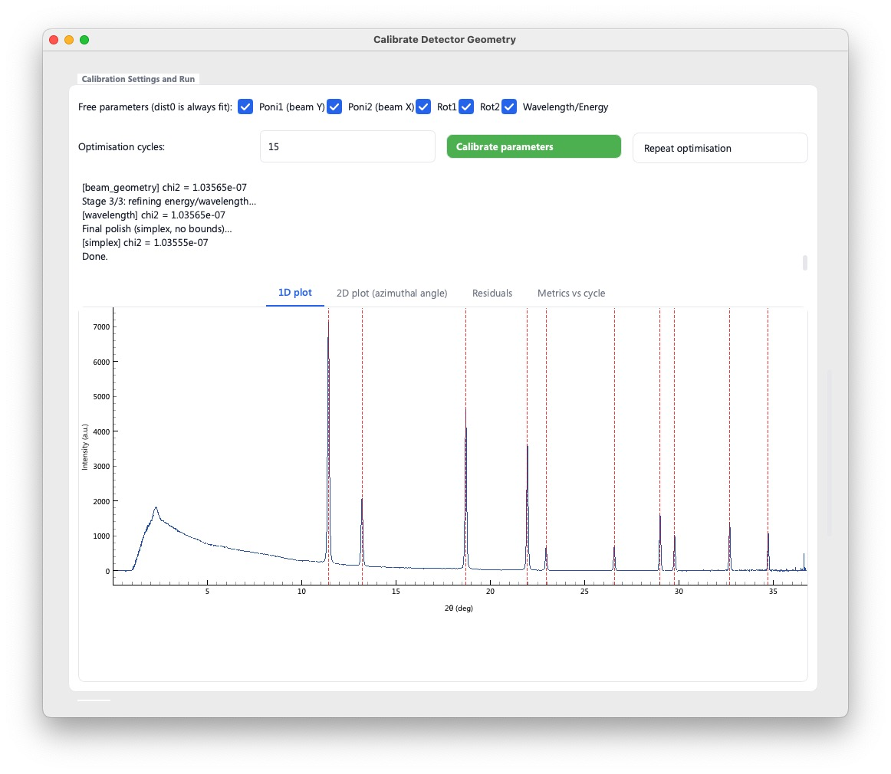
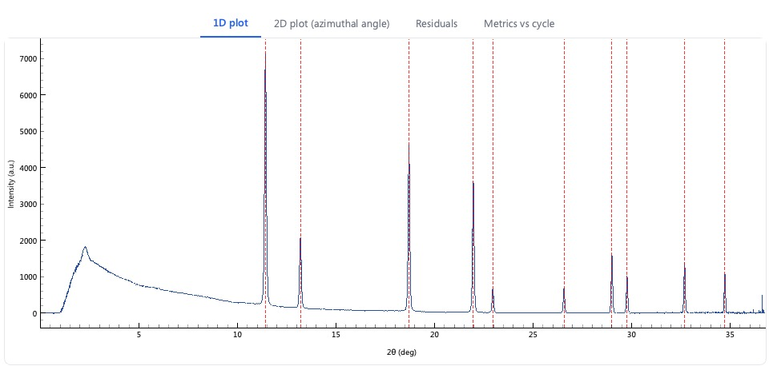
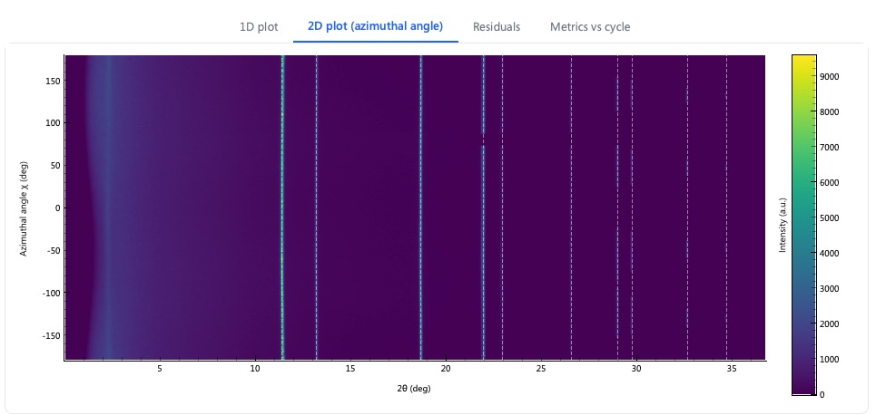
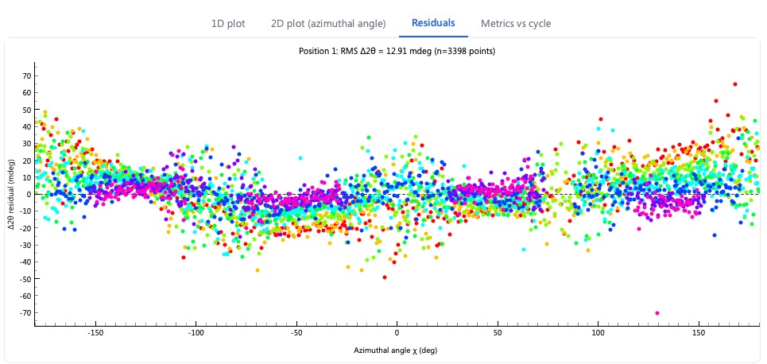
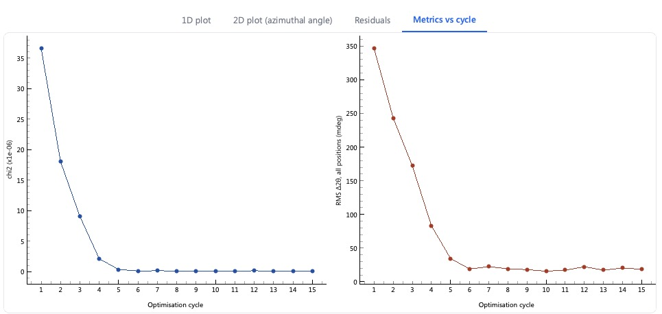
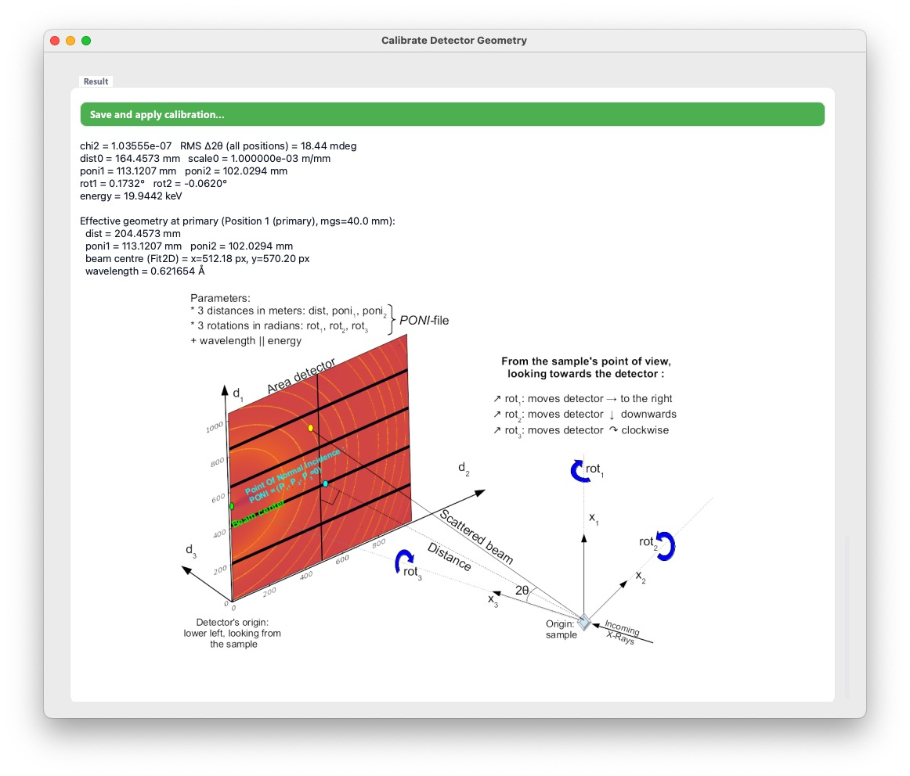

# Calibrate detector geometry

検出器幾何パラメータの校正を行うアプリケーション。ユーザーはスクロールしながらUIを操作し、必要な段階を踏んで進んでいけば検出器の校正を行えるようになっている。なお、このアプリケーションは、ビームライン備え付けの Rad-icon 2022によって取得されたデータの解析を目的としており、その他の検出器でのデータには使えない。

## Step 1: 標準試料の選択、画像の取得ないし読み込み

- ユーザーはまず標準試料として何を用いるかを選択する。Otherを選び、試料名を入力すると、対応している場合、suggestion が表示されるので、それをクリックすると適用できる。
- ２つ**以上**の異なる検出器位置において取得された標準試料の回折像が必要。
- ユーザーは、まずデータを取得した際の検出器の mgs 値を入力する。次いで、 **Take XRD**ボタンを押してデータをその場で取得する、または、**Load Image**ボタンを押して、すでに取得してあるデータを読み込む。
  - Take XRD を行うためには、別ウィンドウで Rad-icon 2022 controller が立ち上がっていることが必要。立ち上げていない場合、メインウィンドウから立ち上げ、必要なパラメータを設定しておくこと。露光時間など、測定に関するパラメータは、全て、現在開かれている Rad-icon 2022 controller の画面から読み込まれ、そのまま利用される。

## Step 2: 初期パラメータの設定

- 初期パラメータの入力方法として、 (1) IPAnalyzer のパラメータファイル、 (2) PyFAI のパラメータファイル（PONIファイル）、 (3) 手動入力、の３つが選べる。
- 手動入力の場合、検出器距離と中心位置、波長を大まかに合わせておけばよい（わりと大雑把で大丈夫です）。
  - **Auto-detect beam centre in the primary image** ボタンを押すと、Primary image (Position 1のデータ)から、自動的に中心位置を推定して補完します。真円の場合、画像をフリップさせても重心は変化しないことを利用して、中心のピクセル位置を推定しています。この推定は、とくに一部が欠けているDebyeリングがある場合には、あまりうまくいかないこともありますが、なお、続くパラメータ校正のサイクルで修正できる範囲には入る可能性が高いので、まずこれを試してみるのがおすすめです。
  - 一つ前のステップで読み込んだ Primary 画像が、アプリ内に表示されています。その画像内で右クリックすると、右クリックした位置を中心位置として登録できます。

## Step 3: 校正の実行

校正を行うパラメータを選択し（デフォルトでは全てチェックを入れてある）、Calibrate parameters を押します。入力された数だけサイクルを実施し、検出器のパラメータを求めます。

アプリケーションは、ユーザーに対して、校正から得られたパラメータの良し悪しを判定するために、４つのプロットを提供します。

1. 求められたパラメータをもとに1次元化した、Primary画像のX線回折データ 
1. 求められたパラメータをもとに、方位角積分した、Primary画像のX線回折データ（いわゆるケーキプロット） 
1. 求められたパラメータをもとに、標準試料のDebyeリング上を方位角積分した際に、計算される値と実測値がどれくらいずれているか（RMS $\Delta 2\theta$ ）を、Primary画像のX線回折データに対して計算し、方位角の関数としてプロットしたデータ 
1. chi^2 および RMS $\Delta 2\theta$ がサイクルを経るごとにどう発展したかを示すプロット 

## Step 4: 結果の確認

- 得られた検出器パラメータが表示されます。またそれぞれのパラメータの定義を示すために、PyFAI のチュートリアルから抜粋してきた画像を表示しています。
- **Save and Apply Calibration**を押すと、PyFAIのキャリブレーションファイル（PONIファイル）とIPAnalyzerのキャリブレーションファイル（prmファイル）の二つが保存されます。また、同時に、本アプリ内で再利用できるように、得られたパラメーターをアプリ内に適用します。
  - IPAnalyzer の prm ファイルへの変換については、 [こちらのドキュメント](./DOC_IPA_PONI.md) を参照してください。
  - PONIファイルのアプリ内再利用については、[README.md](../README.md#xrdデータの解析に関する機能) を参照してください。
