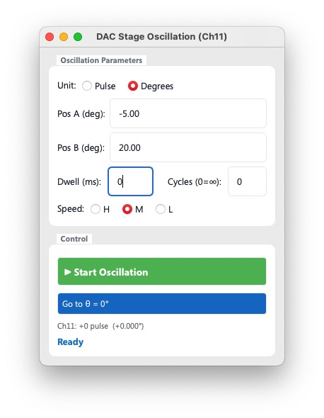

# DAC oscillation

Ch11を用いて、試料の揺動を行うためのアプリケーションです。

## 機能紹介

- **Pos A** および **Pos B** として入力した位置を往復します。値は、 **Unit** を切り替えることで、パルス値でも、角度でも入力することができます。
- Dwell は、Pos AならびにPos Bにおける待機時間です。ただし、実機においては、通信や、ステージが完全に停止していることを確認することに時間がかかることから、これを0 msに設定したとしても、実際にはすぐに折り返し操作が始まるわけではなく、1 秒未満ではありますが、わずかな遅延は生じます。したがってこの値にあまり定量性はないと考えていただいたほうが良いです。
- Cycles を設定すると、指定した回数の往復が完了した際に、動作が停止します。