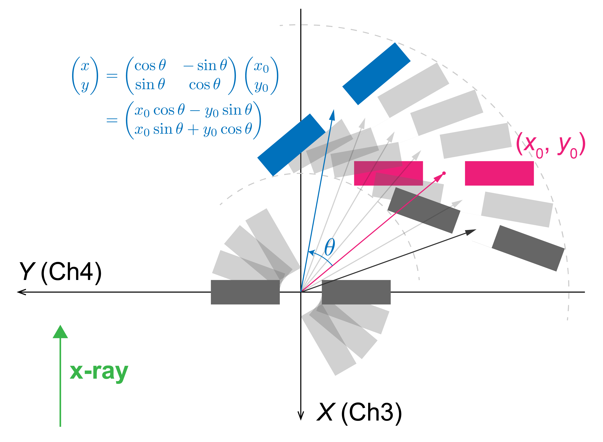
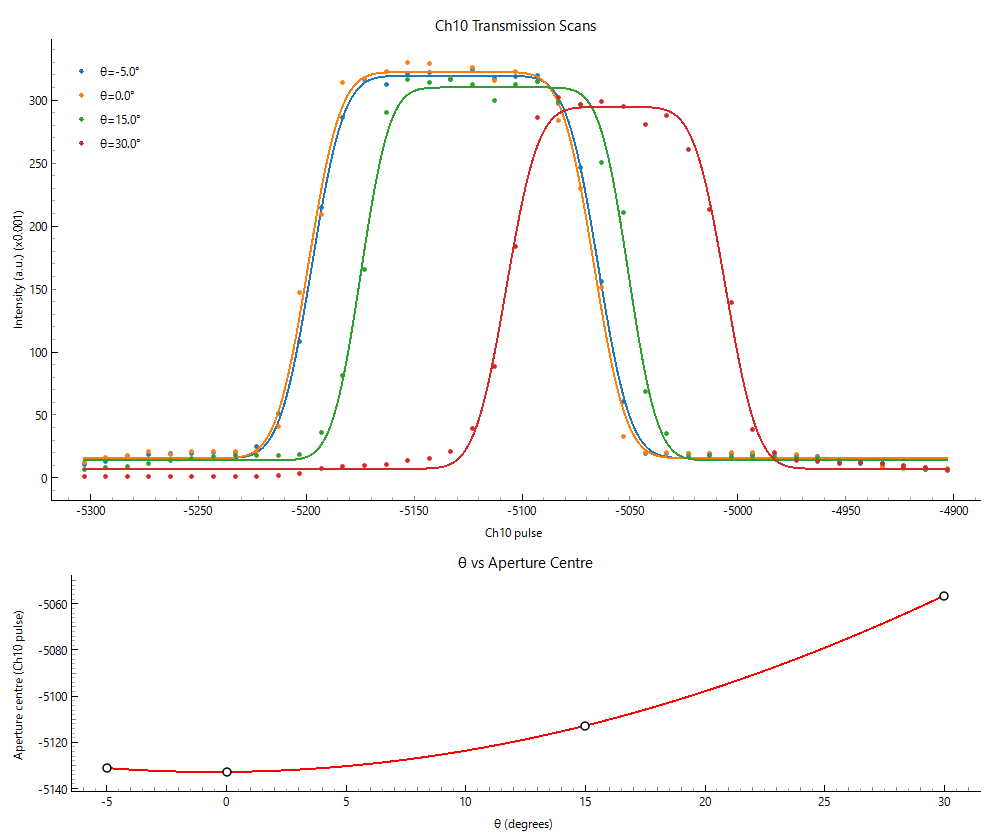
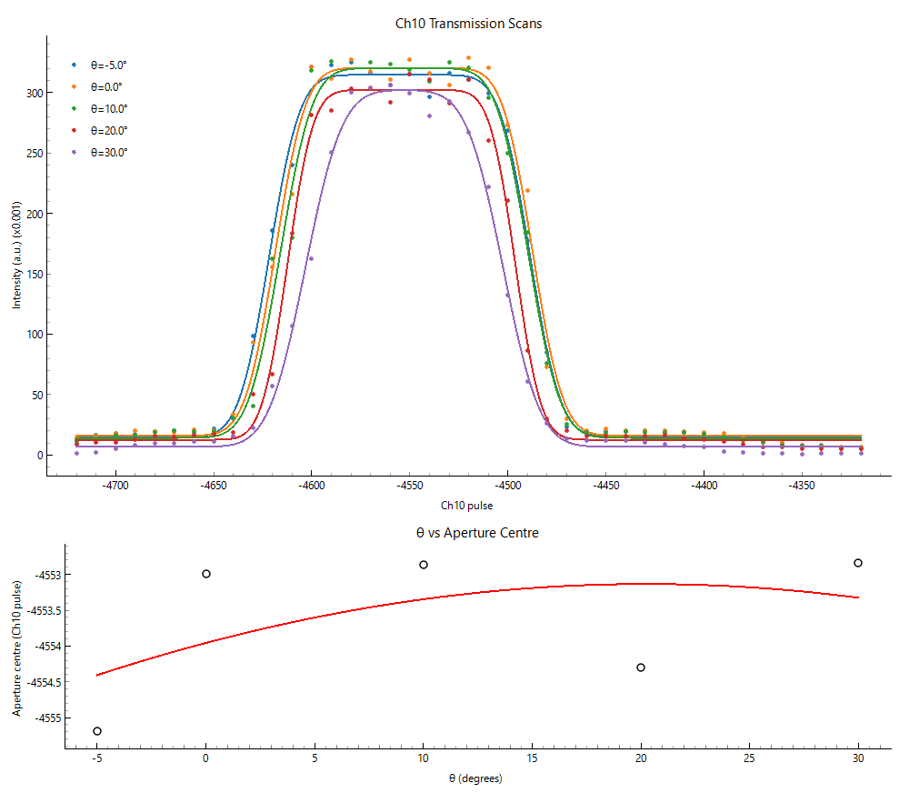

# Scans > DAC scan (rotation centre)

DACの中心をCh11の回転中心軸上に持ってくるため、Ch10によってY方向にスキャンすることで、DACの中心位置の回転中心からの移動量を定量的に見積もり、Ch3および4を動かすことによって回転中心とDACの中心を一致させるためのアプリケーションです。

## ステージ構成

Ch3,4,5 は回転ステージ Ch11 の上に乗っており、それ全体が Ch10 （Y方向）の並進ステージの上に載っています。

## 幾何学的な説明

DACを回転させた時の挙動を、模式的に下図に示す。
回転中心を原点とし、DACの初期位置を $(x_0, y_0)$ とする。Ch11によって $\theta$ だけ回転されたとき、移動後の DACの座標は、

$$
\begin{aligned}
\begin{pmatrix}
x \\
y
\end{pmatrix}
&=
\begin{pmatrix}
\cos\theta & -\sin\theta \\
\sin\theta & \cos\theta
\end{pmatrix}
\begin{pmatrix}
x_0 \\
y_0
\end{pmatrix}
\\
&=
\begin{pmatrix}
x_0\cos\theta-y_0\sin\theta \\
x_0\sin\theta+y_0\cos\theta
\end{pmatrix}
\end{aligned}
$$

となる。したがって、 Ch10 （Y方向）のスキャンによって得られる、中心位置の Y 座標は、 $\theta$ の関数として、 $y(\theta) = x_0\sin\theta+y_0\cos\theta$ と書ける。本プログラムでは、多数かつできるだけ幅広い $\theta$ 領域（現実的な例として、たとえば -５度、0度、10度、20度、30度 の5点）で得られた中心位置（Y座標＝Ch10パルス位置）を、 $\theta$ の関数としてフィッティングすることで、解析的に $(x_0, y_0)$ を推定し、これをもとにしてDACを回転中心に移動させるために必要なCh3およびCh4の移動量を計算している。

できるだけ幅広い角度範囲で振ることが重要で、角度範囲が狭すぎると $\sin\theta$ の寄与が小さすぎてうまく $x_0$ と $y_0$ が分離できない。

以下は、実機を用いたスキャン結果の一例である。

- 1回目のスキャン

- 2回目のスキャン

スキャンで求める中心位置には数パルス程度は誤差があるので、上記の2回目のスキャン程度に良い状態が得られたら、それ以上は動かさないようにするのが得策です。