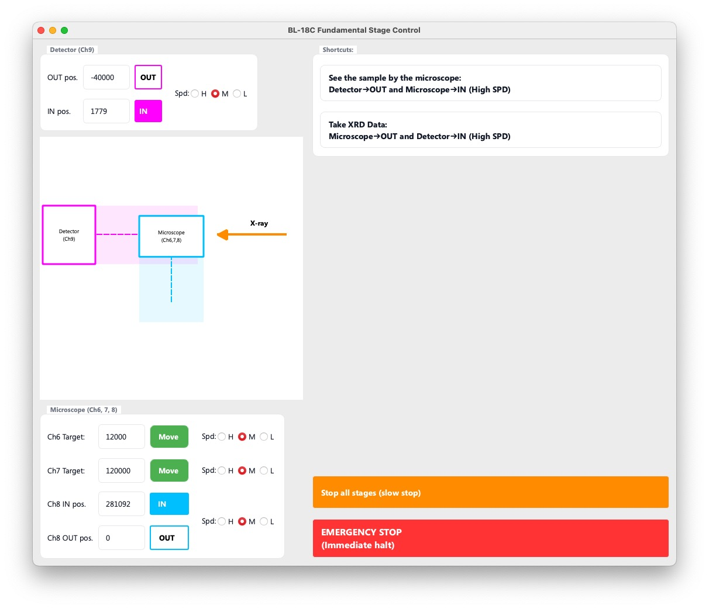

# FPD and scope stage controller

X線検出器ステージおよび試料ステージの移動を制御します。




## 機能紹介
### Detector (Ch9)

- **OUT pos**は検出器の退避位置（顕微鏡を入れることができる位置）、 **IN pos**は、X線回折の測定位置です。
- Spdは、このアプリから制御する際に適用されるステージの移動速度です。

### Microscope (Ch6, 7, 8)

- Ch6およびCh7は、Moveボタンを押すと、入力した値（絶対値）へと移動します。Ch7を頻繁に切り替えるケースなどにおいて、キーボード入力でCh7を目的の場所まで移動させることができるため便利です。
- Ch8には、**OUT pos**（退避位置、FPDのINが許可される位置）と、**IN pos**（試料観察位置）があります。
- Spdは、このアプリから制御する際に適用されるステージの移動速度です。

### ショートカット

- 検出器OUT→顕微鏡IN および 顕微鏡OUT→検出器INを、ひとつながりの動作として行うコマンドです。これらの操作は、同時に実行されることはなく、常に最初の動作が終了したことを確認し、ステージが完全に停止したのを確認してから次の動作に移行します。

### 通常停止、緊急停止

- PM16Cコントローラーには、通常停止（減速停止）および緊急停止（即時停止）の二つのコマンドがあります。

## UIの自動アップデート

- この画面が前面に来ているとき、アプリケーションは 0.5 秒ごとにステージの現在地を読み取り、入力欄および現在のステージ位置の表示をアップデートします。また、このアプリが前面に来た際にも、改めてステージの現在地を読み直し、表示をアップデートします。したがって、手動でステージを動かしたからといって、このアプリに反映されないということは起こらないように設計されています。

## 安全対策

Ch8 と Ch9 の IN/OUT 操作は、ステージを正面から衝突させる可能性のある危険性のある操作です。ステージの衝突を防ぐために、以下の安全対策が実装されています。

1. 入力値チェック：Ch9のOUT位置は、-30000より小さくなければならない。また、Ch8のOUT位置は、0より小さくなければならない。
1. ステージ操作時の再チェック：Ch8を0以下に移動させるコマンドが送られたとき、またCh9を-30000以上に移動させるコマンドが送られたとき、Ch8およびCh9の現在地を確認し、安全な範囲に入っているかを確認してから、実際の移動コマンドを送信する。

これらの安全対策のパラメータは、全てのアプリに対して共通に例外なく適用するものであるから、各アプリ内には定義せず、 [utils/control_stage.py](../../utils/control_stage.py) にまとめて定義されている。2026年7月時点での実装内容は、以下のとおりであり、他のステージに対してもリミッターをかけたい場合には、同様の文法で記述すれば、リミッターを追加することができる。

```python
CH9_CH8_SAFE_BOUNDARY = -30000

MOVE_CONSTRAINTS = [
    # Ch9 > CH9_CH8_SAFE_BOUNDARY requires Ch8 <= 0
    # Moving Ch9 TO the boundary or more negative (OUT direction) is always safe.
    # Only moving Ch9 INTO the beam path is restricted.
    {
        'target_ch': 9, 'target_op': '>', 'target_val': CH9_CH8_SAFE_BOUNDARY,
        'required': [
            {'ch': 8, 'op': '<=', 'val': 0},
        ],
    },
    # Ch8 > 0 requires Ch9 <= CH9_CH8_SAFE_BOUNDARY
    # Moving Ch8 TO 0 or more negative (OUT direction) is always safe.
    # Only moving Ch8 INTO the beam path is restricted.
    {
        'target_ch': 8, 'target_op': '>', 'target_val': 0,
        'required': [
            {'ch': 9, 'op': '<=', 'val': CH9_CH8_SAFE_BOUNDARY},
        ],
    }
]
```