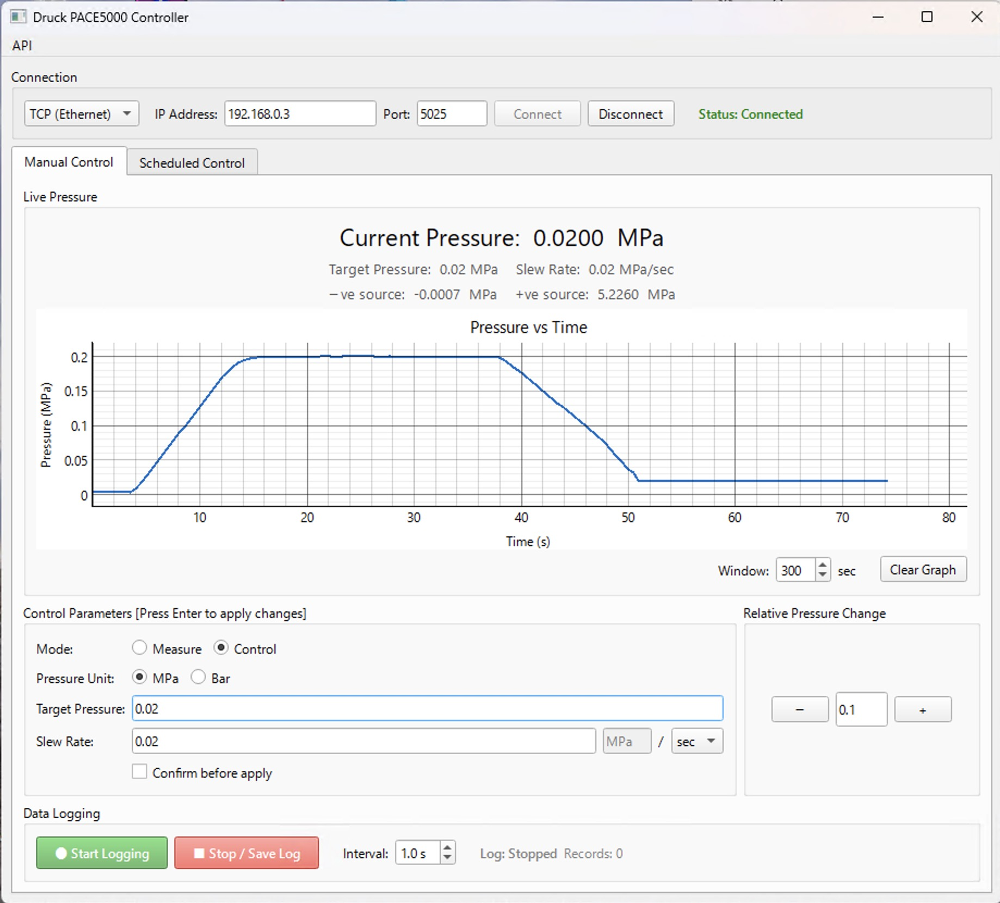
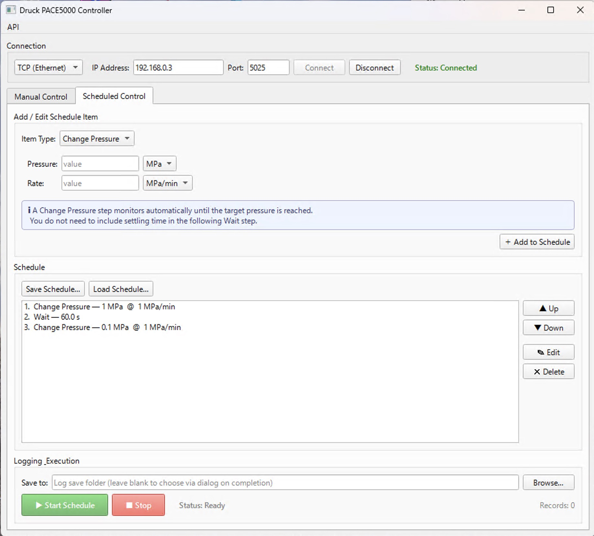

# Druck PACE5000 pressure controller "PaceMaker"

メンブレン駆動 DAC の圧力制御に用いるガス圧コントローラ Druck PACE5000 を制御するためのアプリケーションです。メイン画面およびスケジュール制御画面の二つの画面からなります。

## メイン画面

- Mode: ガス圧をコントロールするか、コントロールせずに単にモニターするかを選択します。ラジオボタンの選択は、即時反映されます。
- Pressure Unit: PACE5000 は MPa および Bar に対応しており、それらを切り替えることができます。
- Target Pressure: 設定圧力であり、Enterキーを押すまでは反映されません。本アプリケーションは、ガスボンベから供給される圧力（+ve source）を常時モニターしており、Target Pressureの変更時に、+ve source 圧力よりも高い値が設定された際には警告を出して操作をブロックします。
- Slew Rate: ガス圧変更時の速度であり、Enterキーを押すまでは反映されません。時間の単位として sec および min が選択できます。制御可能な最低速度は 0.0001 MPa/sec であり、これは時間および圧力の単位には依存しません。これ以下の速度が設定された際には、警告を出して捜査をブロックします。
- Confirm before apply: チェックすると、Enterキーが押された際に、改めて圧力ないし速度を変更するかどうかを尋ねるポップアップが開き、誤ったキーボード操作で設定値が変更されることを防ぎます。
- Relative pressure change: 現在値からの相対値で Target Pressure を変更します。変更は即時反映されます。
- Data Logging: CSV形式でログデータを保存します。

## スケジュール制御画面

- 事前に設定したパターンに則って圧力を上下させる機能です。Change Pressure および Wait をサポートしています。