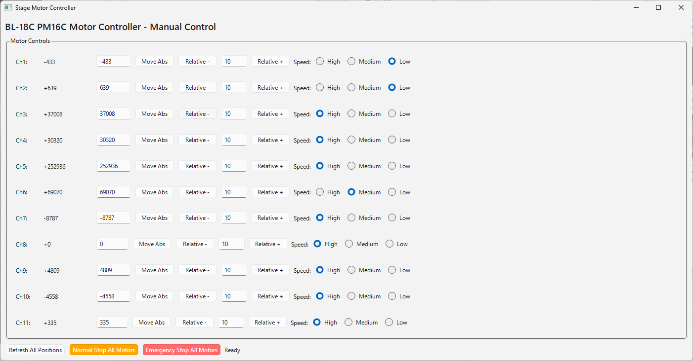

# Simple controller for all stages

全てのステージをパルスモーターのパルス数に基づき制御できるシンプルな制御系です。

本アプリケーションは、それぞれのステージについて、以下の動作を行います：
1. 絶対パルス数を指定しての移動（Move Abs）
1. 現在値に対する相対値を指定しての移動（relative -, Relative +）
1. プリセットされた３つの速度（L, M, H）から一つを選択する形でのステージ移動速度の変更

> [!IMPORTANT]
> このアプリケーションは、ステージ操作に習熟したユーザー向けであり、どのステージがどの動作に対応するかがわからないユーザーには、手動コントローラによる操作を推奨します。