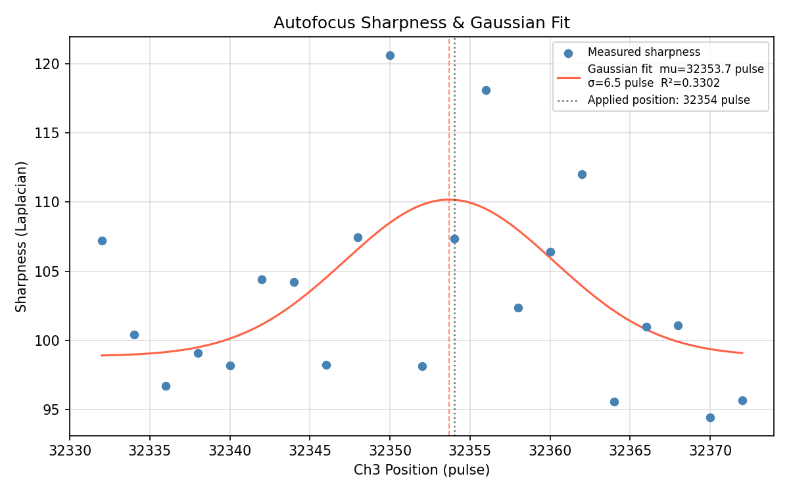
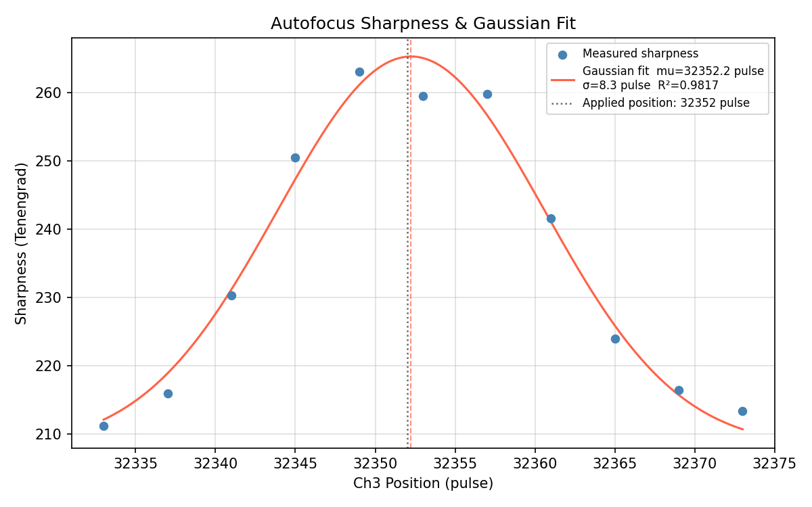

# Interactive camera で用いられている画像認識手法に関して


<!-- ## オートフォーカスはどのように実施するべきか？ -->

## オートフォーカスにおける画像の鮮明さの評価手法

オートフォーカスは、カメラのピント方向（試料ステージを動かす場合、Ch3、カメラ自体を動かす場合、Ch7）をスキャンしながら連続的に画像を取得し、 **それぞれの画像のシャープネスを計算** して、画像が最も鮮明になるステージ位置を探す機能です。

Interactive camera アプリには、2種類の異なるシャープネス計算方法が実装されています。

### 1. Tenengrad 

Tenengradは、画像中の **エッジの強さ（勾配）** を利用してシャープネスを評価するフォーカス指標であり、 Python では OpenCV (cv2) を用いて比較的簡単に実装できます。

まず、画像 $I(x,y)$ に対して、いわゆるSobelフィルターと呼ばれるカーネルを用いて $x$ および $y$ 方向の一次微分を近似します：

$$
G_x = I * S_x, \qquad
G_y = I * S_y
$$

ここで $*$ は畳み込みを表し、3×3 Sobelカーネルは

$$
S_x=
\begin{bmatrix}
-1 & 0 & 1\\
-2 & 0 & 2\\
-1 & 0 & 1
\end{bmatrix},
\qquad
S_y=
\begin{bmatrix}
-1 & -2 & -1\\
0 & 0 & 0\\
1 & 2 & 1
\end{bmatrix}
$$

です。この計算は、 OpenCV を用いて次のように実装されており、カーネルのサイズを ``ksize`` 引数として渡します。

```python
gx = cv2.Sobel(gray, cv2.CV_64F, 1, 0, ksize=3)
gy = cv2.Sobel(gray, cv2.CV_64F, 0, 1, ksize=3)
```

各画素の勾配強度は

$$
\left| \nabla I \right| ^2 = G_x^2 + G_y^2
$$

で求めます。


画像の全体ないしある ROI におけるシャープネスの値としては、各ピクセルにおける勾配強度の平均を取り、

$$
T=\frac{1}{N}\sum_{i=1}^{N}\left(G_{x,i}^2+G_{y,i}^2\right)
$$

をTenengrad値 $T$ として利用します。


### 2. Variance of Laplacian

Variance of Laplacianは、画像中の **エッジの急峻さ（二次微分）** を利用してシャープネスを評価します。

まず、画像 $I(x,y)$ に対してLaplacianフィルターを適用し、二次微分を近似します。

$$
L = \nabla^2 I
$$

OpenCVでは、3×3カーネルとして

$$
\begin{bmatrix}
0 & 1 & 0\\
1 & -4 & 1\\
0 & 1 & 0
\end{bmatrix}
$$

が用いられます。

これは、OpenCVを用いて

```python
lap = cv2.Laplacian(gray, cv2.CV_64F)
```

と実装されています。

Laplacian画像の分散

$$
S = \mathrm{Var}(L)
= \frac{1}{N} \sum_{i=1}^{N} (L_i-\bar{L})^2
$$

をシャープネスの指標として用います。ここで $\bar{L}$ はLaplacian画像の平均値です。

OpenCVでは

```python
score = cv2.Laplacian(gray, cv2.CV_64F).var()
```

と実装できます。

### 3. Tenengrad と Laplacian の比較

> [!Important]
> GUI ではオートフォーカスに用いる手法を選択できる余地を残していますが、常に Tenengrad を利用することを推奨します。

- 実機を用いたテストにおいても、基本的には Tenengrad で全てうまくいき、総じて Tenengrad のほうがはっきりとコントラストがつきます。おそらく、Tenengrad が一次微分を利用するのに対して、Laplacianは２次微分を利用するため、少しボケている部分があるとそれに引きずられてシャープネスの評価が落ち込むことが一因と考えられ、DAC試料のようにガスケットと試料で異なるピントの合い方をするケースではあまりうまくいかないのかもしれません。
- Tenengrad は画素ごとの強度の一次微分を利用するため、Laplacian（二次微分）よりノイズに強く、特に試料の振動する低温実験ではこの効果は顕著なものとなります。

例として、GM冷凍機を用いた低温実験中、試料が振動する環境においてDAC試料のオートフォーカスを行ったとき、画像全体のシャープネス指数がCh3の移動量の函数としてどう変化するかをプロットした図を示します。プロット中の1点は10回の画像取得→シャープネス計算結果の平均値を表します。Tenengrad でははっきりとコントラストがついており、オートフォーカスが適切に実行できていますが、Laplacian Varianceを用いると、ほぼコントラストがついておらず、ピントの合う点を適切に判定できていないことがわかります。

- Laplacian Variance

- Tenengrad
